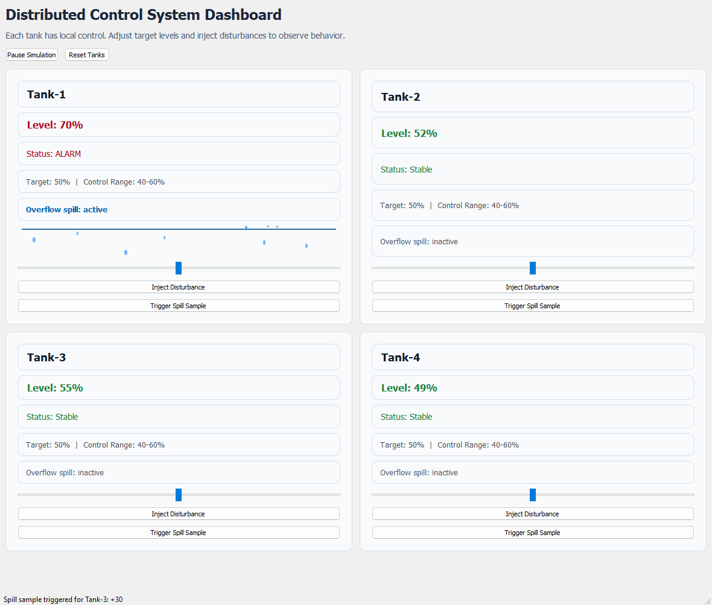

# Algebra-to-DCS

`Algebra-to-DCS` is a small educational simulation that connects basic tank-level algebra to a Distributed Control System (DCS)-style dashboard.

The app uses a PyQt UI to simulate multiple tanks, local control actions, and disturbances in real time.

## Dashboard Preview



## Why This Project Exists

Many control problems start from the same mass-balance idea:

\[
\frac{dL}{dt} = Q_{in} - Q_{out}
\]

Where:

- `L` is tank level
- `Qin` is inflow rate
- `Qout` is outflow rate

A practical DCS applies this logic repeatedly for many units at once, each with local control and central monitoring.

## What the App Simulates

- 4 independent tanks (local controllers)
- A target level for each tank (operator-adjustable)
- Automatic correction when level leaves the acceptable range
- Random process fluctuations
- Operator-triggered disturbances (positive or negative)
- Central dashboard with status and alarm-style color cues

## Current Architecture

The project is intentionally lightweight and contained in one file:

- `DCS.py`: Tank model + PyQt dashboard

Core model:

- `TankState`: per-tank simulation state (`level`, `target_level`, tolerance, disturbance)
- `step()`: one simulation cycle with disturbance + control correction
- `DCSApp`: dashboard that renders all tanks and updates them on a timer

## Requirements

- Python `3.9+`
- `PyQt5`

Install dependency:

```bash
pip install -r requirements.txt
```

## Run

From the repository root:

```bash
python DCS.py
```

## Dashboard Controls

- `Pause Simulation`: stop/resume time updates
- `Reset Tanks`: restore all tanks to default values
- Tank slider: set that tank's target level
- `Inject Disturbance`: apply a sudden random change to the selected tank

## Interpreting Tank Status

- `Stable`: level is comfortably inside the control range
- `Warning`: level is near the range boundary
- `ALARM`: level is outside the control range

## Notes and Limitations

- This is a teaching/demo simulation, not a plant-grade control application.
- No networked PLC/RTU communication is included yet.
- Controller behavior is simplified to make math-to-control mapping easy to see.

## Next Improvements (Optional)

- Add trend charts for each tank
- Add PID-style configurable control instead of fixed correction
- Split model/view into separate modules and add unit tests for `TankState`
- Add real distributed communication (sockets, MQTT, or OPC-UA mock)


